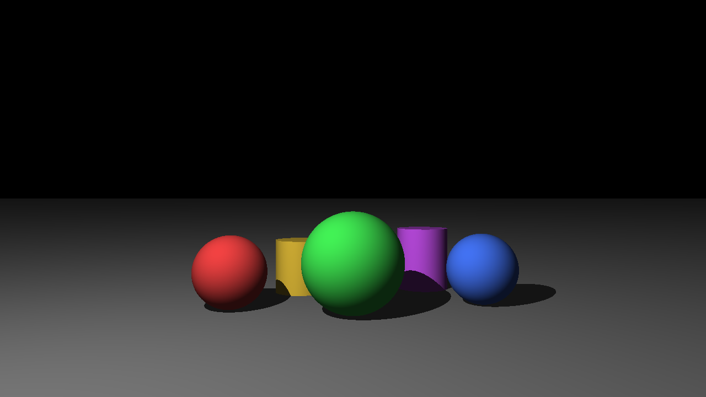

*This project has been created as part of the 42 curriculum by djspright.*

# miniRT

A minimal **ray tracer** written in C with [MiniLibX](https://github.com/42Paris/minilibx-linux).
It reads a simple `.rt` scene description and renders it from a configurable
camera using ambient + diffuse (Lambert) lighting and hard shadows. The three
mandatory primitives — **plane**, **sphere**, and **cylinder** — are supported,
with correct handling of every intersection (including the inside of objects and
the cylinder caps).



## Description

Ray tracing produces an image by shooting one ray per pixel from the camera into
the scene, finding the closest surface each ray hits, and shading that point
according to the lights. This project implements the essential pieces from
scratch:

- a small 3D vector library (dot/cross products, normalization…);
- a pinhole camera with translation, rotation and a horizontal field of view;
- analytic ray/object intersection for planes, spheres and finite cylinders
  (body + the two end caps);
- a lighting model with ambient light, diffuse shading and hard shadows;
- a hand-written parser for the `.rt` scene format with strict validation and
  clean error reporting (`Error\n` + a human-readable message);
- a MiniLibX window that displays the rendered image and closes cleanly on
  `ESC` or the window's close button.

The code targets **both Linux (X11) and macOS (Metal)** from a single source
tree; the `Makefile` selects the right MiniLibX and the platform-specific
details (key codes, teardown) are isolated behind `#ifdef` at file scope.

## Instructions

### Build

```sh
make          # builds the matching MiniLibX, then miniRT
make clean    # remove object files
make fclean   # remove object files and the binary
make re       # fclean + all
```

On **macOS** the bundled `minilibx_mms_20200219` (Metal/Swift) is compiled into
`libmlx.dylib`; on **Linux** the bundled `minilibx-linux` is compiled into
`libmlx.a`. The correct one is chosen automatically from `uname`.

### Run

```sh
./miniRT scenes/all.rt
```

The program takes exactly one argument: a scene file ending in `.rt`.
Ready-made scenes live in `scenes/` (e.g. `sphere.rt`, `plane.rt`,
`cylinder.rt`, `all.rt`, `multi.rt`, `minimal.rt`). Intentionally broken scenes
for testing error handling are under `scenes/bad/`.

Controls:

- `ESC` — close the window and quit cleanly.
- window close button (red cross) — quit cleanly.

### Scene file format (`.rt`)

Each element is on its own line; fields are separated by spaces/tabs; elements
may appear in any order. `A`, `C` and `L` may be declared only once.

| id   | meaning   | format                                                        |
|------|-----------|---------------------------------------------------------------|
| `A`  | ambient   | `A <ratio 0-1> <r,g,b>`                                        |
| `C`  | camera    | `C <x,y,z> <nx,ny,nz> <fov 0-180>`                             |
| `L`  | light     | `L <x,y,z> <ratio 0-1> <r,g,b>`                               |
| `sp` | sphere    | `sp <x,y,z> <diameter> <r,g,b>`                               |
| `pl` | plane     | `pl <x,y,z> <nx,ny,nz> <r,g,b>`                              |
| `cy` | cylinder  | `cy <x,y,z> <ax,ay,az> <diameter> <height> <r,g,b>`         |

Colours are integers in `[0,255]`; coordinates and sizes are floating-point.

## Mathematics

Everything the renderer does reduces to one idea. A ray is a point sliding along
a straight line,

$$
P(t) = O + t\,\mathbf{D}, \qquad t \ge 0,
$$

and **intersecting an object means substituting $P(t)$ into the object's equation
and solving for $t$**. The smallest positive root is the first surface the ray
hits. A plane yields a linear equation, a sphere or a cylinder yields a
quadratic — that is the whole catalogue. With $\lvert\mathbf{D}\rvert = 1$, the
parameter $t$ is literally the distance from the ray origin, so "closest hit"
is just "smallest $t$".

### Vector toolbox

| Operation | Definition | Key property | Used for |
|---|---|---|---|
| Dot product | $\mathbf{a}\cdot\mathbf{b} = a_x b_x + a_y b_y + a_z b_z$ | equals $\lvert\mathbf{a}\rvert\lvert\mathbf{b}\rvert\cos\theta$ — positive: same side, zero: perpendicular, negative: opposite | Lambert term $\mathbf{N}\cdot\mathbf{L}$; parallel test $\mathbf{D}\cdot\mathbf{n}$; every quadratic coefficient below |
| Cross product | $\mathbf{a}\times\mathbf{b}$ | perpendicular to both inputs; $\lvert\mathbf{a}\times\mathbf{b}\rvert = \lvert\mathbf{a}\rvert\lvert\mathbf{b}\rvert\sin\theta$; anti-commutative; **zero when inputs are parallel** | building the camera basis (`right`, `up`) from the view direction |
| Normalization | $\hat{\mathbf{a}} = \mathbf{a} / \lvert\mathbf{a}\rvert$ | length 1, direction unchanged | makes $t$ a distance and makes dot products pure $\cos\theta$ |
| Projection | $m = \mathbf{x}\cdot\hat{\mathbf{a}}$ | signed length of the shadow of $\mathbf{x}$ along $\hat{\mathbf{a}}$ | height along the cylinder axis; splitting vectors into axial + radial parts |

A rule of thumb that decodes most of the vector code: *point − point =
direction*, *point + direction = point* (e.g. `light.pos - hit.point` is "the
direction from the hit towards the light").

### Intersections

**Sphere** — the set of points at distance $r$ from the center $C$. With
$\mathbf{X} = O - C$:

$$
\lvert P - C\rvert^2 = r^2
\;\Longrightarrow\;
(\mathbf{D}\cdot\mathbf{D})\,t^2 + 2(\mathbf{X}\cdot\mathbf{D})\,t + (\mathbf{X}\cdot\mathbf{X} - r^2) = 0 .
$$

The discriminant $\Delta = b^2 - 4ac$ counts the hits: $\Delta < 0$ miss,
$\Delta = 0$ tangent, $\Delta > 0$ the ray pierces the sphere (entry $t_0$,
exit $t_1$). If $t_0 < 0 < t_1$ the ray starts **inside** the sphere: we keep
the exit point and flip the normal towards the ray. Surface normal:
$\mathbf{N} = \mathrm{normalize}(P - C)$.

**Plane** — a point $P_0$ plus a unit normal $\mathbf{n}$; "being on the
plane" means being perpendicular to the normal:

$$
(P - P_0)\cdot\mathbf{n} = 0
\;\Longrightarrow\;
t = \frac{(P_0 - O)\cdot\mathbf{n}}{\mathbf{D}\cdot\mathbf{n}} .
$$

When $\lvert\mathbf{D}\cdot\mathbf{n}\rvert < \varepsilon$ the ray is parallel
to the plane: no hit, and the guard doubles as division-by-zero protection.

**Cylinder** — the trick is to remove the axial component and reduce the
problem to a 2-D circle. With $\mathbf{X} = P - C$ and unit axis $\mathbf{a}$,
the distance from the axis is the length of $\mathbf{X} - (\mathbf{X}\cdot\mathbf{a})\,\mathbf{a}$
(the radial remainder after subtracting the projection):

$$
\bigl\lvert\, \mathbf{X} - (\mathbf{X}\cdot\mathbf{a})\,\mathbf{a} \,\bigr\rvert^2 = r^2 ,
$$

which expands to another quadratic in $t$. Two extra steps make it a *finite*
cylinder: a hit is kept only if its height along the axis satisfies
$\lvert m\rvert \le h/2$ where $m = \mathbf{X}\cdot\mathbf{a}$, and the two end
caps are plane intersections restricted to $\mathrm{dist}^2 \le r^2$. The side
normal is the radial remainder itself, normalized.

### Camera

Placing a virtual screen at distance 1 in front of the eye turns the field of
view into a right triangle, so the screen half-width is
$\tan(\mathrm{fov}/2)$ (the code's `fov * PI / 360.0` merges the
degree-to-radian conversion with the halving). The screen axes come from two
cross products: `right = normalize(world_up × dir)` and `up = dir × right`,
giving an orthonormal basis. When the view direction is almost vertical it
becomes parallel to `world_up` and the first cross product collapses to zero,
so `world_up` is swapped to $(0, 0, 1)$ in that case.

### Shading

Diffuse brightness follows **Lambert's cosine law**: a light beam hitting a
surface at an angle spreads the same energy over a larger area, so the
received energy per unit area scales with $\cos\theta$ — which, for unit
vectors, is exactly the dot product:

$$
\mathrm{brightness} \propto \max(0,\; \mathbf{N}\cdot\mathbf{L}) .
$$

The final color is the object color modulated component-wise by
(ambient + diffuse). Shadows reuse the intersection code: a point is shadowed
if a ray from it towards the light hits anything *before* the light. The
shadow ray origin is lifted by a small bias along the normal, otherwise
floating-point rounding can place the hit point slightly inside the surface
and the ray "shadows itself" (shadow acne).

## Resources

Classic references used while implementing the maths:

- *Ray Tracing in One Weekend* — Peter Shirley (camera, sphere intersection,
  shading basics).
- *Scratchapixel* — "Ray-Tracing: Generating Camera Rays" and
  "A Minimal Ray-Tracer" (FOV/aspect ratio, ray–plane and ray–cylinder maths).
- The MiniLibX manual pages (`man/`) shipped with the library.
- The 42 *Norm* (v4.1) for the coding standard.

### How AI was used

AI assistance (Claude Code) was used as a pair-programming and reviewing tool:
to scaffold the repetitive, norm-constrained boilerplate (the vector library,
per-object intersection skeletons), to cross-check the cross-platform MiniLibX
build, and to run adversarial reviews for norm compliance, memory safety and
edge cases. Every generated piece was read, verified by rendering reference
scenes, and is fully understood by the author — nothing is included that cannot
be explained during evaluation. The mathematical conventions (camera basis,
normal orientation, shadow bias) were validated visually against rendered
images, not taken on faith.
